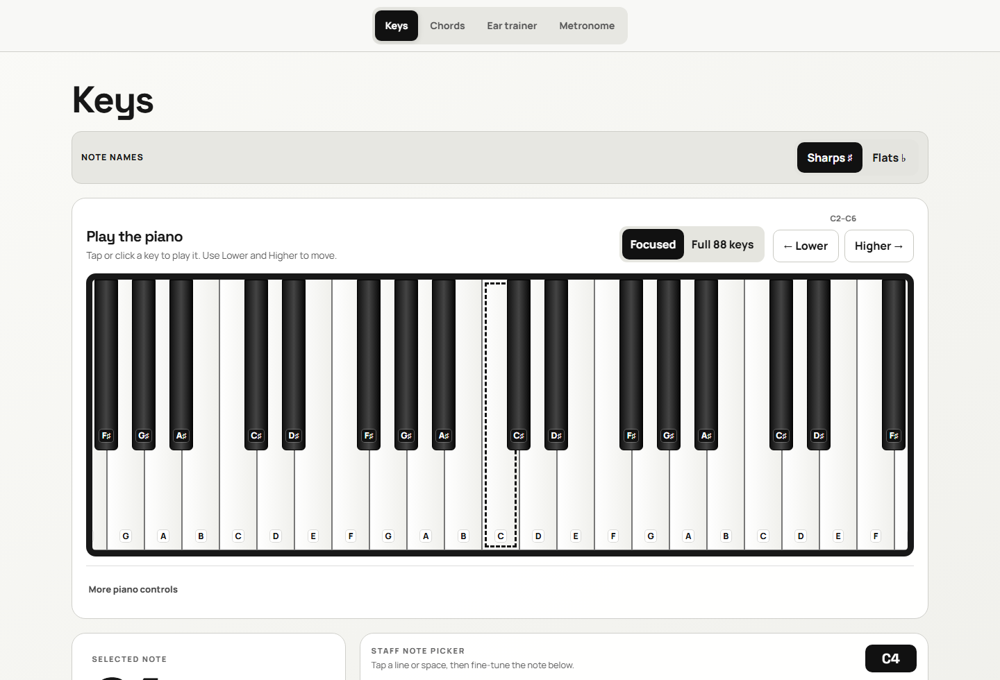

<div align="center">

# Piano Tutor

**Play notes, build chords, train your ear, and keep time — entirely in the browser.**

[**Open Piano Tutor →**](https://adamnolle.github.io/Keyboard-Tutor/)

[](https://github.com/AdamNolle/Keyboard-Tutor/actions/workflows/ci.yml)
[](https://github.com/AdamNolle/Keyboard-Tutor/actions/workflows/deploy.yml)

</div>



## Four focused tools

| Section         | What it does                                                                                                                  |
| --------------- | ----------------------------------------------------------------------------------------------------------------------------- |
| **Keys**        | Play a large keybed, choose sharp or flat spellings, pick notes directly from the staff, explore scales, or view all 88 keys. |
| **Chords**      | Browse chord families, see the exact keys to press, hear notes together or separately, and explore inversions.                |
| **Ear trainer** | Practice pitch matching, note finding, intervals, chord quality, sight reading, and rhythm.                                   |
| **Metronome**   | Set tempo, meter, subdivisions, count-in, presets, or tap your own tempo.                                                     |

## Play your way

- **Touch or mouse:** tap, hold, or glide across the piano.
- **Computer keyboard:** `A W S E D F T G Y H U J K` plays a chromatic octave, `Z` / `X` changes octave, and Space holds sustain.
- **MIDI:** connect an optional Web MIDI keyboard in a supported secure-context browser.
- **Sound:** generated locally with the Web Audio API—no samples, microphone, account, or backend.

The **Focused** view provides large playable keys. **Full 88 keys** provides a complete keyboard overview; switch back to Focused for accurate playing.

## Run locally

Requires Node.js 22 or newer.

```bash
npm ci
npm run dev
```

Open the local URL printed by Vite. To run the complete validation suite:

```bash
npm run format:check
npm run lint
npm run typecheck
npm test
npm run build
npm run build:root
npm run verify:build
```

## Offline, private, and accessible

Piano Tutor is an installable PWA. After the first successful visit, its core interface works offline. Trainer scores and sound preferences stay in `localStorage`; there is no telemetry or third-party runtime request.

The interface includes keyboard navigation, visible focus, reduced-motion and forced-colors support, concise live feedback, textual notation equivalents, and touch-friendly controls. Automated checks are not a WCAG conformance claim; screen-reader, zoom, touch, mobile audio, and physical MIDI testing remain part of release review.

## Deployment

Pushes to `main` are validated by [CI](.github/workflows/ci.yml) and deployed to GitHub Pages by the [Pages workflow](.github/workflows/deploy.yml). The production base path is `/Keyboard-Tutor/`; a root-domain build is also verified.

## Credits and licensing

Application source is copyright © 2026 Adam Nolle. No license is granted for reuse.

Manrope, Space Grotesk, and Bravura are distributed under the SIL Open Font License 1.1. Copyright notices, sources, and complete font licenses are listed in [`public/fonts/NOTICE.md`](public/fonts/NOTICE.md).
